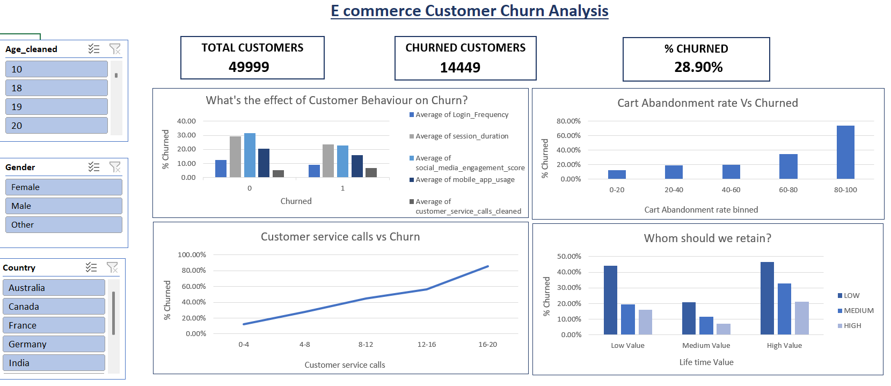
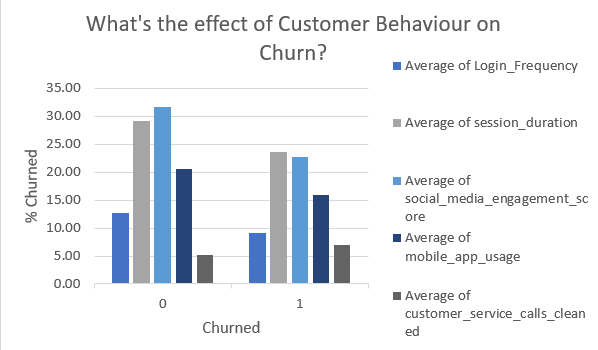
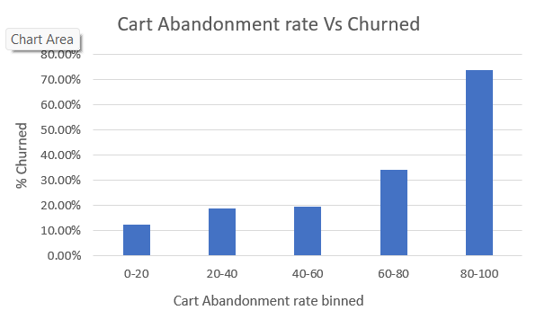
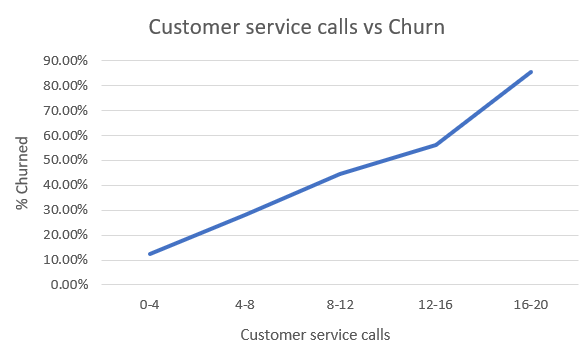
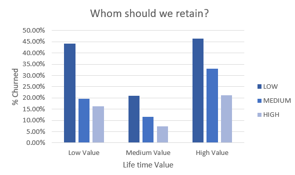

# 📊 E-Commerce Customer Churn Analysis

## 🖼️ Dashboard Preview

---

## 📌 Overview

This project focuses on analyzing **customer churn behavior** in an e-commerce platform using Excel. The objective is to understand how customer activity, engagement, and service interactions influence churn.

By examining key behavioral metrics such as login frequency, session duration, cart abandonment, and customer support interactions, this analysis helps identify **high-risk customers** and provides actionable insights to improve retention strategies.

---

## 📂 Dataset Description

The dataset contains customer demographic details, behavioral metrics, and transaction-related information.

| Column Name | Description |
|------------|------------|
| Age_cleaned | Customer age |
| Gender | Gender of customer |
| Country | Customer location |
| Membership_Years | Years as a customer |
| Login_Frequency | Number of logins |
| session_duration_avg_cleaned | Avg session time |
| Cart_Abandonment_Rate_cleaned | % of abandoned carts |
| pages_per_session_cleaned | Pages visited per session |
| wishlist_items_cleaned | Wishlist items count |
| Total_Purchases | Total orders placed |
| Average_Order_Value | Avg order value |
| discount_usage_rate_cleaned | Discount usage |
| days_since_last_purchase_cleaned | Recency |
| Inactive_duration | Inactivity duration |
| returns_rate_cleaned | Return rate |
| email_open_rate_cleaned | Email engagement |
| customer_service_calls_cleaned | Support calls |
| social_media_engagement_score_cleaned | Engagement score |
| mobile_app_usage_cleaned | App usage |
| Lifetime_Value | Total customer value |
| Churned | Target variable (0 = No, 1 = Yes) |

---

## 📈 Key Insights

### 1️⃣ Effect of Customer Behavior on Churn

- Non-churned customers:
  - Login Frequency ≈ **30**
  - Session Duration ≈ **28 mins**
  - Engagement Score ≈ **32**
- Churned customers:
  - Login Frequency ≈ **10**
  - Session Duration ≈ **22 mins**
  - Engagement Score ≈ **23**

👉 **Insight:**  
Low engagement customers are **2–3x more likely to churn**.

---

### 2️⃣ Cart Abandonment Rate vs Churn

- 0–20% → **~12% churn**
- 20–40% → **~18% churn**
- 40–60% → **~20% churn**
- 60–80% → **~35% churn**
- 80–100% → **~75% churn**

👉 **Insight:**  
High cart abandonment customers are **~7x more likely to churn**.

---

### 3️⃣ Customer Service Calls vs Churn

- 0–4 calls → **~12% churn**
- 4–8 calls → **~25% churn**
- 8–12 calls → **~45% churn**
- 12–16 calls → **~55% churn**
- 16–20 calls → **~85% churn**

👉 **Insight:**  
More complaints = significantly higher churn risk.

---

### 4️⃣ Whom Should We Focus On? (Retention Strategy)

- High-value customers → **~47% churn**
- Medium-value customers → **~20% churn**
- Low-value customers → **~44% churn**

👉 **Insight:**  
High-value customers are at risk → **top priority for retention**.

---

### 5️⃣ Overall Churn Snapshot

- Total Customers: **49,999**  
- Churned Customers: **14,449**  
- Churn Rate: **28.90%**

👉 **Insight:**  
Nearly **1 in 3 customers churn**, indicating a major retention challenge.

---

## 🛠️ Tools Used

- Microsoft Excel  
  - Data Cleaning  
  - Pivot Tables  
  - Data Analysis  
  - Dashboard & Visualization  

---

## ⚙️ Methodology

1. **Data Cleaning**
   - Removed inconsistencies and handled missing values  
   - Standardized column formats  

2. **Data Transformation**
   - Created bins for churn analysis (e.g., cart abandonment, service calls)  
   - Categorized customers into segments (low, medium, high value)  

3. **Exploratory Data Analysis (EDA)**
   - Used pivot tables to analyze relationships  
   - Compared churn vs non-churn groups  

4. **Visualization**
   - Built charts to identify patterns  
   - Designed an interactive dashboard for insights  

---

## 🔑 Key Takeaways

- Customer engagement is the **strongest factor influencing churn**
- High cart abandonment is a **critical warning signal**
- Frequent customer service calls indicate **customer dissatisfaction**
- High-value customers are **not safe and need attention**
- Retention strategies should focus on **behavioral improvement**

---

## ✅ Conclusion

This project demonstrates that **customer behavior directly impacts churn**.  

By improving engagement, reducing cart abandonment, and addressing customer issues proactively, businesses can significantly reduce churn and improve customer lifetime value.

A data-driven approach like this enables companies to move from **reactive decisions → proactive retention strategies**.

---

## 🚀 Future Scope

- Build a **churn prediction model using Machine Learning**
- Create an **interactive dashboard using Power BI or Tableau**
- Deploy insights into a **real-time analytics system**
  ## 👩‍💻 Author

**Sajja Yasodha Krishna**  
- B.Tech Student | Data Science Enthusiast  
- Skilled in Excel, SQL, Python, Data Analysis  

🔗 [LinkedIn](www.linkedin.com/in/
yasodha-krishna-sajja-114aa72b7
)  
